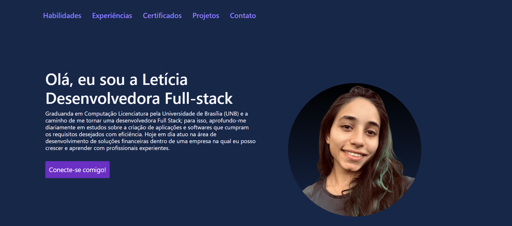
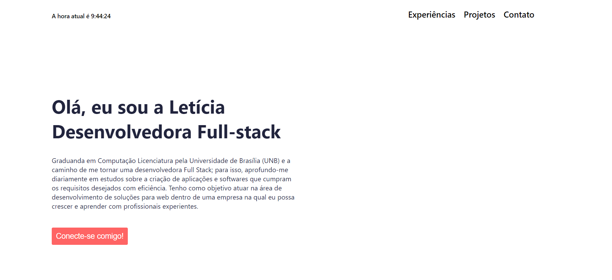

# Portfólio Profissional

[Link do site disponibilizado](https://portfoliodev-leticiasouza.vercel.app)

### Requisitos necessários para executar o projeto:

Para executar o projeto, é necessário ter o Node.js e o npm (Node Package Manager) instalados em sua máquina.

Versões utilizadas:
- npm versão 10.4.0
- node versão 20.11.0

### Dependências utilizadas no projeto:

Dependências:
- "bootstrap": "^5.3.3",
- "react": "^18.2.0",
- "react-bootstrap": "^2.10.2",
- "react-dom": "^18.2.0",
- "react-icons": "^5.0.1"

Dependências de desenvolvimento:
- "@types/react": "^18.2.66",
- "@types/react-dom": "^18.2.22",
- "@vitejs/plugin-react": "^4.2.1",
- "eslint": "^8.57.0",
- "eslint-plugin-react": "^7.34.1",
- "eslint-plugin-react-hooks": "^4.6.0",
- "eslint-plugin-react-refresh": "^0.4.6",
- "vite": "^5.2.0"

### Linguagens utilizadas no projeto e em suas respectivas versões

React: versão 18.2.0

JavaScript: versão ECMAScript 2022 (ES12)

Além disso, utilizou-se algumas bibliotecas e frameworks para auxiliar no desenvolvimento, como o Bootstrap na versão 5.3.3, o React Bootstrap na versão 2.10.2 e o React Icons na versão 5.0.1.

### Descrições das funcionalidades do projeto

O projeto é um portfólio profissional, que é uma compilação de trabalhos, experiências, habilidades, competências, certificações, contatos e da história de vida do desenvolvedor. O portfólio se apresenta em uma única página com sessões específicas, de forma que é fácil navegar por ele. 

### Melhorias implementadas na interface

Feedbacks e pesquisas ajudaram a melhorar o portfólio. Sites em que eu me inspirei:
[site 01](https://brittanychiang.com)
[site 02](https://mattfarley.ca)
[site 03](https://olaolu.dev)
[site 04](https://www.adhamdannaway.com)

##### Alterações realizadas:
- Mudança na paleta de cores
[Paleta usada como inspiração](https://coolors.co/palette/012a4a-013a63-01497c-014f86-2a6f97-2c7da0-468faf-61a5c2-89c2d9-a9d6e5)

- Adição de uma foto de perfil para identificar melhor o desenvolvedor

- Adição de duas sessões: habilidades e certificações

- Retirada no horário

- Adição de um carrossel de imagens com intervalos para mostrar as fotos

- Adição de uma experiência (totalizando três), então utilizou-se o useState para mostrar somente duas de cada vez

- Atualização do resumo

- Formatação do espaçamento e tamanho das letras

### Histórico de versionamento 

##### Antes:

[Versão 1 do projeto](https://portfoliodevleticiasouza.netlify.app)

##### Depois:
[Versão final do projeto](https://portfoliodev-leticiasouza.vercel.app)

### Vídeo do fluxo do site
<video width="320" height="240" src="./assets/video site depois.mp4" type="video/mp4">
